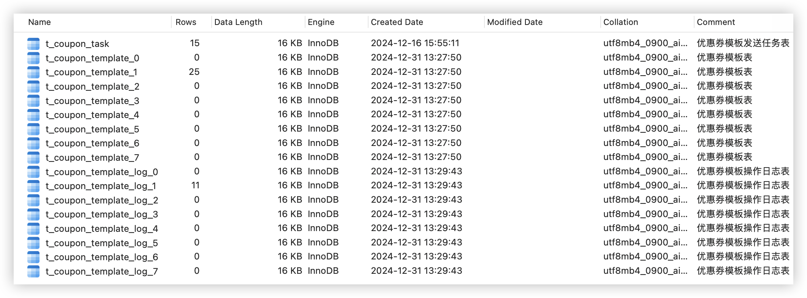
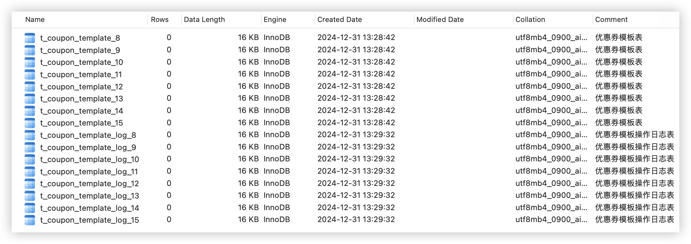

# README

## 数据库表

one_coupon_rebuild_0库



one_coupon_rebuild_1库



## 启动设置

在项目启动的时候添加vm参数如下

```
-Dunique-name=-hyjyouyou -Drocketmq.name-server=common-rocketmq-dev.magestack.cn:9876 -Dspring.cloud.nacos.discovery.server-addr=common-nacos-dev.magestack.cn:8848 
```

项目中设置了

- MySQL连接 `localhost:3306`，密码为`abc123`
- redis连接 `localhost:6379`，密码为`wodeqqhu`

## 测试
Eg.启动merchant-admin模块，测试分页查询功能：

```sh
curl --location --request POST 'http://localhost:10010/api/merchant-admin/coupon-template/page' \
--header 'User-Agent: Apifox/1.0.0 (https://apifox.com)' \
--header 'Content-Type: application/json' \
--data-raw '{
  "current": 1,
  "size": 10,
  "name": "夏季促销满减券",
  "target": 0,
  "goods": "SP001,SP002",
  "type": 1
}'
```

